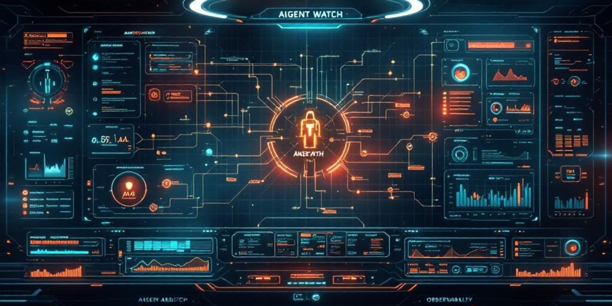

# agent-watch

[](https://www.npmjs.com/package/agent-watch)
[](https://github.com/rankgnar/agent-watch/actions)
[](LICENSE)
[](package.json)

**Observability SDK for AI agents in production.**  
Trace every LLM call, tool use, and decision — locally, with zero cloud dependencies.



---

## Why agent-watch?

You deployed an AI agent. It works — until it doesn't. Then you stare at logs wondering:

- *Which LLM call took 8 seconds?*
- *Which tool returned garbage that broke the chain?*
- *Was it a timeout, a bad prompt, or a malformed response?*

`agent-watch` gives you a **trace tree** for every agent run, so you can answer those questions in seconds instead of hours. No cloud account required. No data leaves your machine.

---

## Install

```bash
npm install agent-watch
```

```bash
# CLI (optional, global)
npm install -g agent-watch
```

---

## Quick Start

### Zero-code proxy (recommended)

Start the proxy — works with any language, any AI provider:

```bash
npx agent-watch --target https://openrouter.ai/api/v1
```

Point your app to `http://localhost:4201` instead of your API URL. Done.

Works with: OpenAI, Anthropic, OpenRouter, Groq, Mistral, Together, Ollama, any OpenAI-compatible API.

### Examples

```bash
# OpenRouter
npx agent-watch --target https://openrouter.ai/api/v1

# Anthropic
npx agent-watch --target https://api.anthropic.com

# Ollama (local)
npx agent-watch --target http://localhost:11434

# OpenAI
npx agent-watch --target https://api.openai.com
```

The proxy captures every request and response automatically — model, tokens, latency, errors.  
The dashboard opens at `http://localhost:4200`.

> **Security:** The proxy only listens on `127.0.0.1` (localhost). API keys are forwarded to the target but **never** stored in the database.

---

### SDK mode (Node.js only)

Add one line to your app:

```js
require('agent-watch/auto');
```

That's it. Every OpenAI and Anthropic call is now traced automatically.
Works with any OpenAI-compatible provider (OpenRouter, Groq, Together, Ollama).

Run the dashboard:

```bash
npx agent-watch serve
```

### Optional configuration (env vars)

| Variable | Default | Description |
|---|---|---|
| `AGENT_WATCH_NAME` | script filename | Agent name shown in the dashboard |
| `AGENT_WATCH_DB` | `~/.agent-watch/traces.db` | Custom SQLite DB path |
| `AGENT_WATCH_DISABLED=true` | — | Disable tracing without removing the line |
| `AGENT_WATCH_DASHBOARD=true` | — | Auto-start the dashboard on port 4200 |

### Manual instrumentation (advanced)

If you need fine-grained control, you can still use the SDK directly:

```typescript
import { createTracer } from 'agent-watch';
import OpenAI from 'openai';

const tracer = createTracer({ name: 'my-agent', store: 'sqlite' });
const openai = tracer.instrument(new OpenAI());

const response = await openai.chat.completions.create({
  model: 'gpt-4',
  messages: [{ role: 'user', content: 'Hello' }],
});
```

Traces are saved to `~/.agent-watch/traces.db`.

---

## SDK API

### `createTracer(config)`

```typescript
const tracer = createTracer({
  name: 'my-agent',       // Agent name — appears in all traces
  store: 'sqlite',        // Storage backend (currently only 'sqlite')
  dbPath: './traces.db',  // Optional: custom DB path
});
```

### `tracer.startTrace(name, options?)`

Start a trace manually. Call `.end()` when done.

```typescript
const trace = tracer.startTrace('process-order', {
  metadata: { orderId: '123', userId: 'abc' },
});

const span = trace.startSpan('validate-input');
span.setAttributes({ orderId: '123' });
span.end('ok');

trace.end(); // auto-computes status from spans
```

### `tracer.withTrace(name, fn)`

Convenience wrapper — the trace is automatically ended when `fn` resolves or throws.

```typescript
const result = await tracer.withTrace('process-order', async (trace) => {
  const span = trace.startSpan('validate');
  span.setAttributes({ orderId: '123' });
  span.end('ok');
  return { status: 'done' };
});
```

### `tracer.instrument(client)`

Monkey-patch an OpenAI or Anthropic client to auto-trace all API calls.

```typescript
const openai = tracer.instrument(new OpenAI());
const anthropic = tracer.instrument(new Anthropic());
```

### `trace.startSpan(name, options?)`

```typescript
const span = trace.startSpan('llm-call', {
  attributes: { model: 'gpt-4', promptTokens: 150 },
});

// ... do work ...

span.setAttributes({ completionTokens: 80 });
span.end('ok');             // or span.endWithError(new Error('...'))
```

### `span.setAttributes(attrs)`

Add metadata to a span at any point before it ends.

```typescript
span.setAttributes({
  model: 'gpt-4',
  temperature: 0.7,
  retryCount: 2,
});
```

### `withTrace(agentName, traceName, fn)` (standalone)

```typescript
import { withTrace } from 'agent-watch';

const result = await withTrace('my-agent', 'task-name', async (trace) => {
  // ...
  return 'done';
});
```

---

## CLI

```bash
# Start proxy mode (recommended — works with any language/provider)
agent-watch --target https://openrouter.ai/api/v1
agent-watch proxy --target https://api.openai.com --port 4201 --dashboard-port 4200

# Show recent traces (last 24h)
agent-watch list

# Filter by agent, status, or time window
agent-watch list --agent my-agent --status error --since 48

# Show full span tree with timing
agent-watch replay abc12345

# Summary metrics (error rate, avg duration, top failures)
agent-watch stats

# Start the web dashboard on port 4200
agent-watch serve --port 4200
```

---

## Dashboard

```bash
agent-watch serve --port 4200
# → http://localhost:4200
```

The dashboard shows:

- **Recent traces** with status and timing, filterable by agent/status/date
- **Span tree** — click any trace to see the full decision tree
- **Stats bar** — error rate, avg duration, recent activity
- **Top failures** — which trace names fail most often

> 📸 _Dashboard screenshot coming soon_

---

## Integrations

### OpenAI

```typescript
import OpenAI from 'openai';
import { createTracer } from 'agent-watch';

const tracer = createTracer({ name: 'my-agent', store: 'sqlite' });
const openai = tracer.instrument(new OpenAI());

// Automatically traces: model, token usage, latency, errors
const response = await openai.chat.completions.create({ ... });
```

### Anthropic

```typescript
import Anthropic from '@anthropic-ai/sdk';
import { createTracer } from 'agent-watch';

const tracer = createTracer({ name: 'my-agent', store: 'sqlite' });
const anthropic = tracer.instrument(new Anthropic());

// Automatically traces: model, input/output tokens, latency, errors
const message = await anthropic.messages.create({ ... });
```

### LangChain

```typescript
import { ChatOpenAI } from '@langchain/openai';
import { createTracer } from 'agent-watch';
import { AgentWatchCallbackHandler } from 'agent-watch/integrations/langchain';

const tracer = createTracer({ name: 'my-agent', store: 'sqlite' });
const trace = tracer.startTrace('langchain-run');

const llm = new ChatOpenAI({
  callbacks: [new AgentWatchCallbackHandler(trace)],
});

const result = await llm.invoke('Hello');
trace.end();
```

The handler automatically creates spans for:

- LLM calls (with token usage)
- Chain runs
- Tool invocations

---

## Use Cases

### 🔍 Debug a failing agent
Your customer support agent suddenly starts giving wrong answers. Instead of digging through raw logs, replay the exact trace to see which tool call returned bad data or which LLM response went off the rails.

```bash
agent-watch list --status error --since 24
agent-watch replay <trace-id>
```

### 📊 Monitor agent performance in production
Track latency, token usage, and error rates across all your agents. Spot regressions before users complain.

```bash
agent-watch stats
# Error rate: 2.3%  |  Avg duration: 1.8s  |  Top failure: timeout in search-tool
```

### 🧪 Compare prompt changes
Changed a system prompt? Run both versions and compare traces side by side — see how token usage, latency, and output quality differ.

### 💰 Track LLM costs per agent
Every trace captures input/output token counts per call. Aggregate by agent to see which one is burning through your API budget.

### 🛡️ Audit agent decisions for compliance
In regulated industries (finance, healthcare), you need a record of *why* an AI made a decision. `agent-watch` gives you the full decision tree with timestamps.

### 🔄 Catch infinite loops and retries
Agent stuck in a retry loop calling the same tool 50 times? The span tree makes it immediately obvious — no more guessing from flat logs.

### 🏗️ Onboard new team members
New developer joins the team? Point them at the dashboard to understand how the agent actually works — what it calls, in what order, and what it expects back.

---

## Self-hosted. Zero cloud. MIT.

All data is stored locally in a SQLite file at `~/.agent-watch/traces.db` (or a custom path via `--db`).  
No API keys. No accounts. No data leaves your machine.

```
MIT License — Copyright (c) 2026 Raul Rosello
```

---

## Contributing

```bash
git clone https://github.com/rankgnar/agent-watch
cd agent-watch
npm install
npm run build
```

PRs welcome. Open an issue first for major changes.
